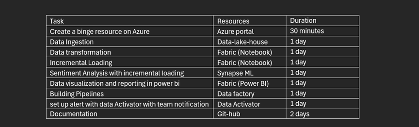

# Life After DP-600 Associate Exam: A Journey through the Binge News Project

## Project Overview
After successfully completing the DP-600 exam, this project serves as a hands-on exploration of advanced data handling using Microsoft Azure and Fabric. The objective of the Binge Project is to set up a fully functional data pipeline that ingests, transforms, and visualizes real-time data, while applying incremental loading and performing sentiment analysis. This documentation serves as your roadmap through each stage of the project, helping you understand not just the how, but also the why behind each task.
watch introductory video [here](https://youtu.be/okrKwdn9Z34?si=H4GwhOyB-hIM-MRB)

## Creating a Binge Resource in Azure
My journey begins with setting up a Binge resource on the Azure Portal. This acts as the foundation for managing all resources and processes needed for the project.
- Step 1: Navigate to Azure Portal and sign in using your Azure subscription account.
- Step 2: Create a new resource group. This group will serve as the umbrella for all resources related to this project, ensuring centralized management and easy monitoring.

Next, head to the Azure Marketplace to create a Bing Search API. The Bing Search API will provide access to real-time news data, which will be central to our sentiment analysis.
- Step 3: In the Marketplace, search for Bing Search v7 and follow the prompts to set it up.
With these foundational resources in place, we move on to Microsoft Fabric to set up a workspace and data Lakehouse, which will store and process the ingested data.
watch the environment set-up video [here](https://youtu.be/JywiK_EPsgE?si=Tp7QZA_qs0OEqfiJ)

## Data Ingestion with Microsoft Fabric

Once my  Lakehouse is ready, the next step is to ingest data into it using Microsoft Fabric’s data pipeline.
- Step 1: Create a data pipeline workspace in Fabric.
- Step 2: In the pipeline, connect to the Bing Search API to fetch US 2024 election news using the Copy Data activity.
The data source will be the REST API, and the destination will be the Lakehouse created earlier. Set the data format as JSON to store the news articles in a file section of the Lakehouse.
- Step 3: After configuring the API and data destinations, save and run the pipeline to ingest the data into the Lakehouse.

Watch the data ingestion video [here](https://youtu.be/tJTXWMhfln8?si=GNFwKzXrkyXb2p73)

## Data Transformation and Incremental Loading
With the data ingested, the next task is to clean and transform the data using Fabric's Notebook.
- Step 1: Create a Notebook under the Data Engineering experience and connect it to the Lakehouse to access the ingested US 2024 election news in JSON format.
- Step 2: Use the Notebook to perform data transformation. The goal is to clean the data and implement incremental loading using a Type 1 Slowly Changing Dimension (SCD) approach. This ensures that as new articles are added to the dataset, old data is replaced, keeping only the latest version without retaining historical changes.

view my transformation code [here](https://github.com/folorunsoajala/Microsoft_fabric_Binge_News_Project/blob/main/Transformed_bing_news.ipynb) and reference video [here](https://youtu.be/GyZ88fAKyBY?si=dRJzAN5sqS9nQi4M)

## Sentiment Analysis Using SynapseML
Once the data is clean and ready, I apply machine learning to perform Sentiment Analysis on the news articles. For this, I leverage SynapseML, an open-source machine learning library within Microsoft Fabric.
- Step 1: Using the AnalyzeText model, we analyze the sentiment of each news article’s description.
- Step 2: The model classifies the sentiment into four categories: Positive, Negative, Neutral, and Mixed.
To handle real-time updates, I ensure that the incremental loading process from the previous stage feeds new articles into the sentiment analysis model. This allows for a continuously up-to-date sentiment report.

view my Sentiment analysis code [here](https://github.com/folorunsoajala/Microsoft_fabric_Binge_News_Project/blob/main/News_sentiment_Analysis.ipynb) and reference video [here](https://youtu.be/-Ai4WwIabWI?si=9CHQZkdj6caL2Kz1)

## Data Visualization and Reporting in Power BI
Now that the sentiment analysis is complete, it’s time to visualize the insights. Power BI will be used to create dynamic reports showcasing the sentiment of the latest news articles.
- Step 1: Connect Power BI to the Lakehouse and visualize the data.
- Step 2: Create charts that reflect sentiment trends over time, providing a powerful visual summary of how public sentiment around the US 2024 election evolves with each news update.
For example, as of August 2024, over 100 news articles were analyzed, with no articles classified under Positive Sentiment, offering a unique perspective on the election narrative.

Watch the Data Visualization and Reporting video [here](https://youtu.be/sZnlJXO4Fx8?si=aujnL9ZXRged9nYv)

## Building Pipelines with Microsoft Fabric Data Factory
Finally, I use Microsoft Fabric data Factory to automate the ingestion, transformation, and analysis pipeline. This ensures that all processes, from data ingestion to visualization, run seamlessly in a fully automated fashion.

Watch the Pipelines with Microsoft Fabric Data Factory [here](https://youtu.be/thgkLSpI27c?si=bITbUZJTCDSTQCP5)

## Setting Alerts with Data Activator
To complete the project, configure alerts using Data Activator. This will notify my team whenever key changes or updates occur within the dataset, ensuring real-time monitoring and immediate action when necessary. Watch Setting Alerts with Data Activator [here](https://youtu.be/RA5qM8DRxu8?si=zDBCOuf7pE6CLkAI)

## Final Project Artifacts

## The Us Election 2024 sentiment analysis conclusion 

